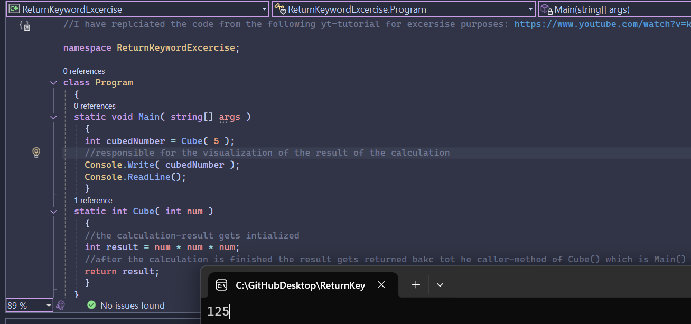

# Return Keyword in C# – Example Project

This project demonstrates how the `return` keyword works in C#. It calculates the cube of a number using a separate method and returns the result back to the caller.

## 📸 Screenshot

